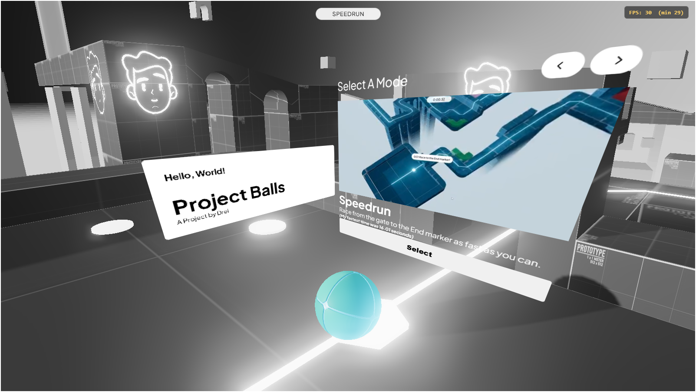
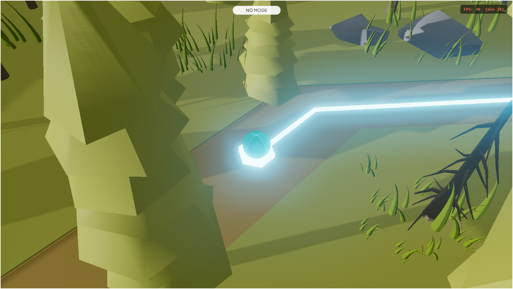
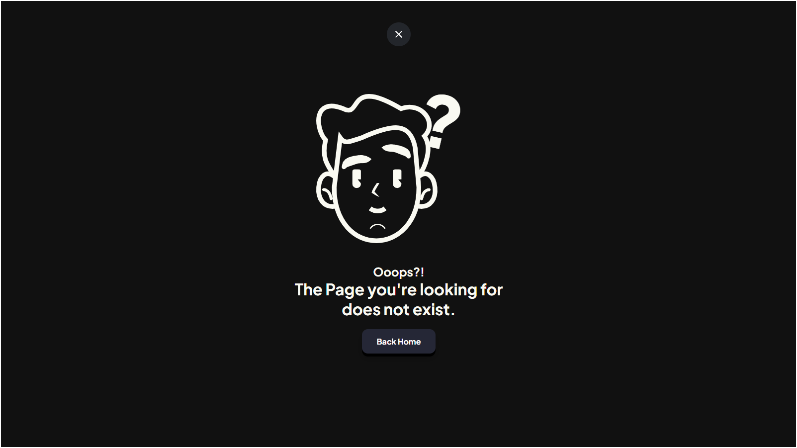
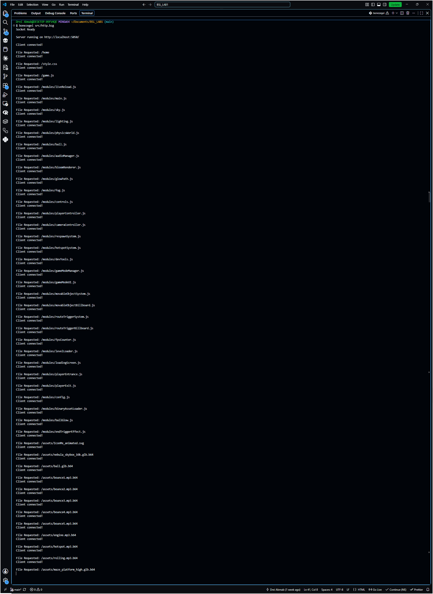

# Project Balls — BSL Socket HTTP Server

A very simple game served entirely by a hand-rolled HTTP server
written in the **Bonezegei Scripting Language (BSL)**.


#####  <center>Image of Unity Build</center>


## Table of Contents

1. [Project Description](#1-project-description)
2. [Installation & Setup Guide](#2-installation--setup-guide)
3. [Usage Instructions](#3-usage-instructions)
4. [What BSL Does in This Application](#4-what-bsl-does-in-this-application)
5. [Screenshots](#5-screenshots)

---

## 1. Project Description

**Maze Ball** is a browser-playable 3D maze game — roll a ball through a
platform maze using WASD or the arrow keys — built with **Three.js** for
rendering and **cannon-es** for physics.

What makes this project different from a typical web app is *how it's
served*. Instead of Node's built-in `http` module or a framework like
Express, every request is handled by a server written from scratch in
**BSL**, which talks directly to raw TCP sockets via BSL's `socket`
native library. The server manually parses incoming HTTP request lines,
determines the right file and MIME type, builds HTTP response headers by
hand, and writes everything back over the socket byte by byte.

The purpose of the project is to demonstrate — at the lowest practical
level — how an HTTP/1.1 static file server actually works underneath the
frameworks most developers use every day: accepting a TCP connection,
reading raw bytes, extracting a request path from an HTTP request line,
mapping that path to a file and a `Content-Type`, and writing a
correctly-formatted response back to the client.

A single process handles everything:

| Component | Role | Port |
|---|---|---|
| **BSL socket server** (`src/http.bzg`) | Hand-rolled HTTP server that routes `/`, `/home`, `/about`, a 404 page, and every static file under `public/` (JS modules, CSS, `.glb` models, `.mp3` audio, images) by extension-based `Content-Type` | `5050` |

### A note on binary assets

Along the way, the project surfaced a real bug in BSL's file-handling
primitives: `readFile()` and `socket_write()` treat every file as a
null-terminated string, so any binary asset containing an embedded
`0x00` byte gets silently truncated in transit — confirmed with
`src/diagnose-binary.bzg`, where a 12,935-byte `.mp3` came back as 4
bytes. This has nothing to do with file size; it's about the byte
content.

The fix: every binary asset (`.mp3`/`.glb`/`.png`) that's fetched at
runtime is shipped as a base64-encoded `<name>.ext.b64` sidecar file next
to the original. Base64 is pure ASCII text with no embedded nulls, so it
passes through `readFile()`/`socket_write()` intact regardless of the
underlying file's size. The browser fetches the `.b64` file and decodes
it back to bytes on the client side — see
`public/modules/binaryAssetLoader.js`. `about.html`'s single static
image is inlined directly as a base64 `data:` URI instead, since that
page has no JavaScript to decode a sidecar file.

The `.b64` files are the actual source of truth at runtime — nothing in
`public/modules/*.js` reads a raw `.mp3`/`.glb`/`.png` file directly.
If you add or replace a binary asset, regenerate its `.b64` file with
`scripts\encode-assets.bat` (or `npm run encode-assets`), or the game
keeps loading the old one.

---

## 2. Installation & Setup Guide

### Prerequisites

- **BSL (Bonezegei Scripting Language)** interpreter — runs the server.
- **Windows** — the bundled socket library (`lib/socket/socket.dll`) is a
  compiled Windows DLL, so this build only runs on Windows.
- **Node.js/npm** — optional. The server itself never needs them; they're
  only used for the auto-encoding + live-reload dev watcher
  (`npm run dev`). If you don't have Node installed, run the interpreter
  directly and use `scripts\encode-assets.bat` manually whenever you
  swap a binary asset.

### Step 1 — Install the BSL interpreter

Pick whichever matches your setup:

**Option A — Microsoft Store (recommended for Windows 10/11)**
1. Open the **Microsoft Store** app.
2. Search for **"Bonezegei Scripting Language"**.
3. Click **Get** / **Install** and wait for it to finish.

**Option B — Standalone Windows installer (.msi)**
1. Download the latest **Windows x64 `.msi`** from the official BSL
   GitHub releases page.
2. Double-click the `.msi` to launch the setup wizard.
3. If SmartScreen flags it as "Unknown Publisher" (the installer is
   self-signed), click **More info → Run anyway**.
4. Follow the wizard, accept the MIT License, and click **Finish**.

**Verify the install:**

```bash
bonezegei --version
```

You should see the installed BSL version printed.

### Step 2 — Set up the socket library

The socket library is **already bundled in this repository** — no
separate download needed:

- `lib/socket.bzg` — BSL wrapper that loads the native functions
  (`socket_init`, `socket_create`, `socket_bind`, `socket_listen`,
  `socket_accept`, `socket_read`, `socket_write`, `socket_close`,
  `socket_cleanup`, `socket_connect`).
- `lib/socket/socket.dll` — the compiled native library those functions
  are loaded from via `loadNative(...)`.

As long as `lib/` stays next to `src/http.bzg`, BSL resolves the
`include("lib/socket.bzg")` call at the top of the server script
automatically — no extra install step required.

If you ever need to redownload it, delete the `lib` folder and run:

```bash
bzg install socket
```

### Step 3 — Run the server

From the project root, either run the interpreter directly (no live
reload, no auto-encoding):

```bash
bonezegei src/http.bzg
```

...or use the auto-reloading dev workflow (requires Node/npm):

```bash
npm run dev
```

`npm run dev` starts two independent processes:

1. `bonezegei src/http.bzg` — the actual server, on port `5050`,
   unchanged.
2. `node scripts/dev-watch.js` — a dev-only watcher that auto-regenerates
   `.b64` files when assets change and live-reloads any open browser tab
   when `.html`/`.css`/`.js` files are saved.

Other available scripts:

| Script | What it does |
|---|---|
| `npm run dev-watch` | Just the watcher, if you're starting the server yourself |
| `npm run server-only` | Just `bonezegei src/http.bzg`, no watcher |
| `npm run encode-assets` | One-shot regeneration of every `.b64` file |
| `npm run dev:once` | `encode-assets` then `bonezegei src/http.bzg`, no watcher |

A successful start prints:

```
Server running on http://localhost:5050/
```
*Note:* My current Setup does not allow to run on Port 8080 because I have my MySQL server running there.


---

## 3. Usage Instructions

With the server running, open a browser and try the following endpoints:

| URL | What happens |
|---|---|
| `http://localhost:5050/` | Redirects (`302 Found`) to `/home` |
| `http://localhost:5050/home` | Loads the Maze Ball game (`public/index.html`) and its assets |
| `http://localhost:5050/about` | Loads the about page (`public/about.html`) |
| `http://localhost:5050/style.css`, `/game.js` | Served directly from `public/` with the correct `Content-Type` |
| `http://localhost:5050/modules/*` | Any file under `public/modules/` (e.g. `/modules/sky.js`) |
| `http://localhost:5050/assets/*` | Any file under `public/assets/` (models, audio, images) |
| `http://localhost:5050/anything-else` | Any unrecognized path returns `404 Not Found` with `public/404.html` |

Once `/home` loads, use **WASD** or the **arrow keys** to roll the ball
through the maze. Each request is logged to the server's terminal (e.g.
`Client connected!`, `File Requested: /home`), which is useful for
confirming the socket server is receiving and routing requests
correctly.

---

## 4. What BSL Does in This Application

### `src/http.bzg` — the server (primary)

This is the core of the project: a full HTTP/1.1 static file server
built on top of raw TCP sockets, with no HTTP library involved. On
startup it:

1. Calls `socket_init()`, `socket_create()`, `socket_bind()` (port
   `5050`), and `socket_listen()` from `lib/socket.bzg` to open a
   listening TCP socket.
2. Enters a blocking `while(1)` loop, calling `socket_accept()` on each
   iteration to accept one client connection at a time.

For every connection, it:

- Reads up to 1024 bytes with `socket_read()` and extracts the request
  path from the HTTP request line with `regex()` and `substr()`.
- Blocks path traversal by rejecting any path containing `..`
  (`containsDotDot()`), on top of a prefix whitelist
  (`isStaticAsset()`) that only allows `/assets/`, `/modules/`,
  `/game.js`, `/about.js`, and `/style.css`.
- Routes `/` to a `302 Found` redirect to `/home`; routes `/home`,
  `/about`, and `/test` to their respective HTML files; routes any
  whitelisted static path to the matching file under `public/`; and
  falls back to `public/404.html` with a `404 Not Found` status for
  everything else, including paths that pass the whitelist but don't
  exist on disk.
- Determines `Content-Type` by file extension (`getContentType()`),
  since BSL's `regex()` didn't support the anchored pattern needed for a
  cleaner match — a plain `endsWith()` built from `substr()` was used
  instead.
- Reads the target file with `readFile()`, and writes the status line,
  headers, and body back to the client with two separate `socket_write()`
  calls (headers first, then body) so that binary content in the body
  can't corrupt the header line's length calculations.
- Closes the connection with `socket_close()` and calls `gc()` to free
  memory before accepting the next client.

Because `readFile()`/`socket_write()` silently truncate any file with an
embedded `0x00` byte, this script never serves raw binary assets
directly — only their base64-encoded `.b64` sidecars (see Section 1).

#### Why assets are converted to `.b64`

`readFile()` and `socket_write()` in `http.bzg` both treat file contents
as null-terminated strings. Any binary asset — `.mp3`, `.glb`, `.png` —
is very likely to contain a `0x00` byte somewhere before its real end,
and the moment one shows up, the read/write stops there and the rest of
the file is silently dropped. This isn't a size limit; it's a byte-content
problem, and it was confirmed directly with `src/diagnose-binary.bzg`
(see below). Base64 encodes arbitrary bytes as plain ASCII text (`A–Z`,
`a–z`, `0–9`, `+`, `/`, `=`) with no `0x00` bytes anywhere in it, so a
base64-encoded copy of an asset passes through `readFile()`/
`socket_write()` completely intact no matter how large or "binary" the
original file is.

#### How the conversion is done

1. **Encoding (offline, before the server ever runs):**
   `scripts\encode-assets.bat` runs Windows' built-in `certutil -encode`
   against each binary file under `public/assets/` (e.g.
   `bounce1.mp3` → `bounce1.mp3.b64`), and the same conversion happens
   automatically via `scripts/dev-watch.js` when running `npm run dev`.
   No BSL code is involved in this step — the `.b64` files are just
   ordinary text files sitting next to their originals in `public/assets/`,
   ready for `http.bzg` to serve like any other static file. `about.html`'s
   one image is handled differently: it's inlined directly as a base64
   `data:` URI in the HTML itself, since that page has no JavaScript to
   fetch and decode a separate sidecar file.
2. **Serving:** `http.bzg` serves a `.b64` file exactly the way it serves
   any other static asset — `readFile()` + `socket_write()` — except it
   sends `Content-Type: text/plain` for it (see `getContentType()`),
   since to the server it's just text.
3. **Decoding (in the browser):** `public/modules/binaryAssetLoader.js`
   fetches `"<asset>.b64"`, strips the `-----BEGIN/END CERTIFICATE-----`
   envelope lines that `certutil -encode` wraps around its output, and
   runs the remaining base64 text through `atob()` to rebuild the raw
   bytes as an `ArrayBuffer` — which is then handed to whatever needs it
   (`AudioContext.decodeAudioData`, `GLTFLoader.parse`, etc.).

If a `.b64` file is ever missing, the corresponding asset fails loudly in
the browser console (`404` on the `.b64` fetch) rather than silently
truncating the way a raw binary request would.

### `src/diagnose-binary.bzg` — binary-truncation diagnostic

A small standalone script used to isolate *where* binary data was being
lost. It compares a file's on-disk size (`fileSize()`) against how many
bytes actually made it into memory after `readFile()` (`sizeof()`) for
`public/assets/bounce5.mp3`. The result — 4 bytes read instead of
12,935 — confirmed that `readFile()` itself was the source of the
truncation, not `socket_write()`, which led directly to the `.b64`
sidecar workaround used throughout the app.

### `src/experiment-http.bzg` — `createHTTPServer()` experiment

An exploratory script testing whether BSL's `lib/http.bzg` exposes a
higher-level, Node-style `createHTTPServer(port, handler)` API as an
alternative to hand-rolling sockets. It was used to probe an
undocumented native function and is not part of the running
application — the project settled on the raw-socket approach in
`src/http.bzg` instead.

---

## 5. Screenshots

### `/` (redirects to `/home` — Maze Ball game)



### `/about`



### Unknown route (404)



### Terminal running the server

